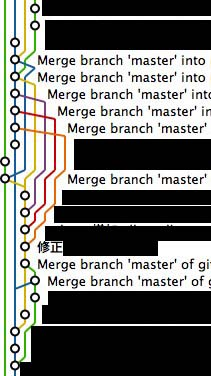

1. <a href="#set-cookie"> set-cookie</a>
2. <a href="#URL">URL</a>
3. <a href="#git-merge">git rebase or merge</a>


<a id="set-cookie"></a>
# set-cookie

### QA
1. Does `set-cookie`  at  `api.domain.com`  work on `mobile.domain.com` ?
2. How long does the **default** cookie remaining?
3. When does cookie count out in client or server?

### protocol

```html
HTTP/1.0 200 OK
Content-type: text/html
Set-Cookie: yummy_cookie=choco
Set-Cookie: tasty_cookie=strawberry
Set-Cookie: id=a3fWa; Expires=Wed, 21 Oct 2015 07:28:00 GMT; Secure; HttpOnly

[page content]
```

### Scope of cookies

The `Domain` and `Path` directives define the *scope* the cookie:what URLS the cookies should be sent to.

`Domain` specifies allowed hosts to receive the cookie. If unspecified, it defaults to the host of the current document location, **excluding subdomains**. If `Domain` is specified, then subdomains are always included.

For example, if `Domain=mozilla.org` is set, then cookies are included on subdomains like `developer.mozilla.org`.

`Path` indicates a URL path that must exist in the requested URL in order to send the `Cookie` header. The %x2F ("/") character is considered a directory separator, and subdirectories will match as well.

For example, if Path=/docs is set, these paths will match:

+ `/docs`
+ `/docs/Web/`
+ `/docs/Web/HTTP`

### ref
<a href="https://developer.mozilla.org/en-US/docs/Web/HTTP/Cookies">https://developer.mozilla.org/en-US/docs/Web/HTTP/Cookies</a>
<a href="https://stackoverflow.com/questions/1062963/how-do-browser-cookie-domains-work">
https://stackoverflow.com/questions/1062963/how-do-browser-cookie-domains-work
</a>


<a id='URL'></a>
# URL 


<a id='git-merge'></a>
# git rebase or merge


### troubles
+ muli workers use the `git pull` on the same brand(below) , too many  unintelligible **merge commit** ,how to solve it?




### QA
+ what do git do after git pull
+ What happend if execute `git rebase master feature` 
+ when we do need `git rebase -i`


## current
```bash
        A---B---C  remotes/origin/master
        /
    D---E---F---G  master
```

## merge 


use `git pull`
```bash
    A---B---C remotes/origin/master
    /         \
D---E---F---G---H master
```

### props
 it’s a non-destructive operation. The existing branches are not changed in any way.

### cons 
the feature branch will have an **extraneous merge commit** every time you need to incorporate upstream changes. If master is very active, this can pollute your feature branch’s history quite a bit. While it’s possible to mitigate this issue with advanced `git log` options, it can make it hard for other developers to understand the history of the project.


## rebase
use `git pull --rebase`
```js
        remotes/origin/master
                |
D---E---A---B---C---F---G--I  master
```
instead of using a merge commit, rebasing **re-writes the project history** by creating brand new commits for each commit in the original branch.The major benefit of rebasing is that you get a much cleaner project history.


### props
This makes it easier to navigate your project with commands like `git log`, `git bisect`, and `gitk`.

### cons
re-writing project history can be potentially catastrophic for your collaboration workflow. And, less importantly, rebasing loses the context provided by a merge commit—you can’t see when upstream changes were incorporated into the feature.

## interactive rebasing

Interactive rebasing gives you the opportunity to alter commits as they are moved to the new branch. This is even more powerful than an automated rebase, since it offers complete control over the branch’s commit history. Typically, this is used to clean up a messy history before merging a feature branch into master.
```bash
pick 33d5b7a Message for commit #f
fixup 9480b3d Message for commit #g
pick 5c67e61 Message for commit #i
```
the commit g is condensed  to commit f
```bash
        remotes/origin/master
                |
D---E---A---B---C---(F&G)---I  master
```

Eliminating insignificant commits like this makes your feature’s history much easier to understand. This is something that git merge simply cannot do.


### pros
rebased **master** onto your **feature** branch


The rebase moves all of the commits in master onto the tip of feature. The problem is that this only happened in your repository. All of the other developers are still working with the original master. Since rebasing results in brand new commits, Git will think that your master branch’s history has diverged from everybody else’s.

The only way to synchronize the two master branches is to merge them back together, resulting in an extra merge commit and two sets of commits that contain the same changes (the original ones, and the ones from your rebased branch). Needless to say, this is a very confusing situation.

So, before you run git rebase, always ask yourself, “Is anyone else looking at this branch?” If the answer is yes, take your hands off the keyboard and start thinking about a non-destructive way to make your changes (e.g., the git revert command). Otherwise, you’re safe to re-write history as much as you like.


<a href="https://www.atlassian.com/git/tutorials/merging-vs-rebasing">https://www.atlassian.com/git/tutorials/merging-vs-rebasing</a>
<a href="http://hungyuhei.github.io/2012/08/07/better-git-commit-graph-using-pull---rebase-and-merge---no-ff.html">http://hungyuhei.github.io/2012/08/07/better-git-commit-graph-using-pull---rebase-and-merge---no-ff.html</a>