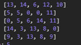
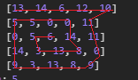
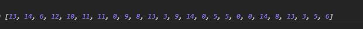
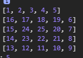
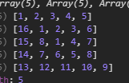
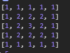
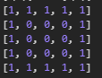
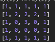
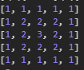

## 题目  
**原矩阵**  
顺时针取值， 
  
得到新的**结果数组**    
  

### 思路

创建一个辅助**顺序矩阵**（代表原矩阵的每个元素的最终顺序 ），  
 
**顺序矩阵****原矩阵**    
然后在遍历原矩阵的时候，对照对应位置的**顺序矩阵**给**结果数组**赋值。

### 步骤
1. 得到**顺序矩阵**
    + 为了方面得到**顺序矩阵**，先产生一个**顺序中间矩阵**和一个**圈数矩阵**   
    **顺序中间矩阵**+**圈数矩阵**=**顺序矩阵**  

    >>思路：上图**顺序矩阵**中的17其实对应的**顺序中间矩阵**中的第二个圈的第一个数字1,1如何变成17，17=1+第一个圈的长度（16），每一个圈的长度都有一定的规律，  
    缩写下：    &nbsp;&nbsp;&nbsp;&nbsp;`2*(currentColumnNum+currentLineNum)-4`  
    数字意义： 长+宽+长+宽-重复计算的部分  
    这里第三圈的外圈长度等于第一圈长度+第二圈的长度，第四也是如此依次递推，所以需要一个递推函数，单独计算外圈的总长度
    `outSideLength = countOutSideLength({lineLength,columnLength,currentCircleNo})`

    + **得到圈数矩阵的过程**  
    初始化一个矩阵  
    转换成最后转换成    

    + **得到顺序中间矩阵的过程**  
    用上面得到的**圈数矩阵**复制然后扩充得到一个新的矩阵
    遍历内圈判断每个元素位于圈的**上，右，下，左**用一定规律得到**顺序中间矩阵**
    + **得到顺序矩阵**  
    遍历上面得到的**顺序中间矩阵**，每个元素加上外圈的总长度得到**顺序矩阵**（这部可以和上一步骤合并，在上一个的遍历内圈时同时加上外圈的总长度）

2. 得到**结果数组**  
    初始化**结果数组**为一个长度为**原矩阵**的长*宽的数组，遍历**顺序矩阵**  ，将对应的行和列的**原矩阵**
赋值给**结果数组**（比如**顺序矩阵**的第4行的第三列的对应的是22，那么**结果数组**的（22-1）个元素为**原矩阵**的第4行的第三列对应的13 ）
