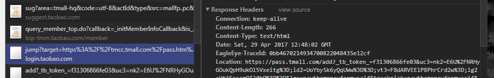
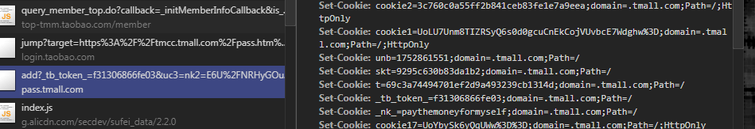
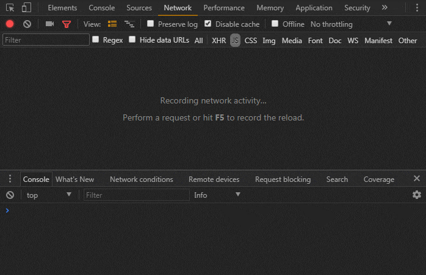

# Cookie 跨域 (登录)

### XHR
>>跨域请求默认不带cookie，需要设置withCredentials为true

`$.ajax({url:'http://
www.taobao.com',xhrFields:{withCredentials:true}})`

#### JSONP 
>>JSONP请求自带cookie(请求域名，不是发起请求的域名)

例子：站点wwww.a.com（js文件放置于cdn）已存有cookie，，浏览www.a.com请求cdn.a.com 
的manifest.js的请求中会带有cookie。 
1. **用于单点登录** 
应用场景taobao.com和tmall.com其中一个登录，访问另一个网址带有登录信息 
先访问taobao.com进行登录，response进行set-cookie，*.taobao.com下现在存有用户信息cookie。 
然后访问tmall，页面会请求自top-tmm.taobao.com下的login_api.do（script标签），script带上\*.taobao.com域名下cookie（这段cookie在tmall.com域名下的脚本是不能直接访问到），服务器接收请求进行cookie判断返回用户信息
	
	请求登录
	
	重定向到pass.tmall（重定向的地址中带有cookie信息）
	
	设置tmall.com下的cookie
	 

2. <b style="font-size:12px">JSONP不带上cookie的方法。</b>  
每次reload时clean-cookie,开始js请求（这时cookie已被清空不会带上）, 然后set-cookie，
之后如果有同域名下的js请求会带有cookie 

	 
*测试方法：修改github的cookie->getScript(带有修改后cookie)->refresh(修改的cookie被重置)*

##### iframe(等补全)
